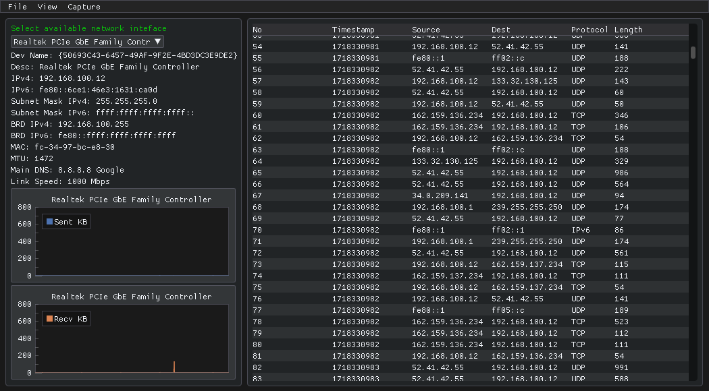
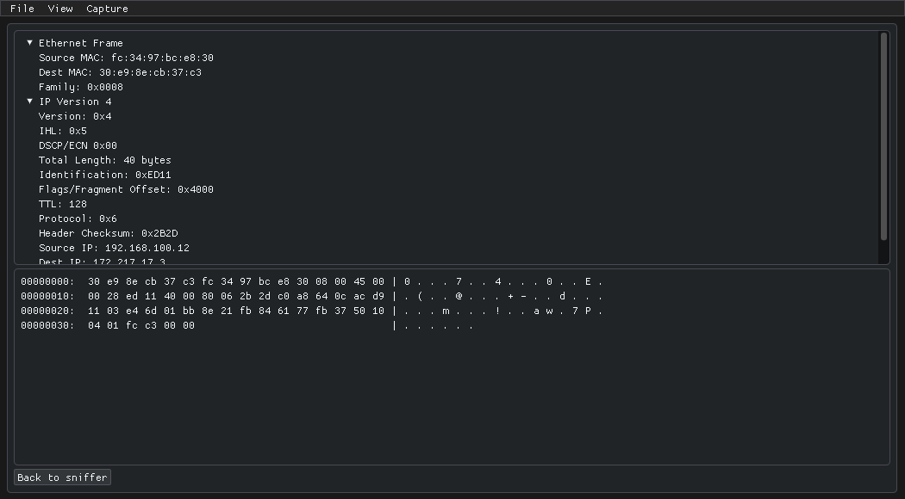

# SpyRaven

  
  

## Table of Contents
- [Introduction](#introduction)
- [Features](#features)
- [Installation](#installation)
- [Usage](#usage)
- [License](#license)

## Introduction

Small alternative to Wireshark built in less than three days. Able to select a network interface to sniff it's traffic in real-time.

## Features

- **Network interface information**: Displays all the available information about the selected network interface.
- **Real-Time Network Monitoring**: Real-time packet capture.
- **Protocol Analysis**: Support for TCP and UDP. Some application protocols support will also be added.
- **Detailed Packet Inspection**: Able to inspect packet headers in detail.
- **Friendly Interface**: Simple user interface using [ImGui](https://github.com/ocornut/imgui).

## Installation

### Windows
1. Install  [Npcap](https://npcap.com/#download).
2. Compile it yourself or use the latest release.

## Usage

### Capturing Traffic
1. Select the network interface you want to monitor.
3. SpyRaven will show information related to that interface and begin capturing and displaying network traffic in real-time.

### Stop Capturing
1. Select Capture > Stop capturing
2. To resume capturing, select the same or other network interface in the drop down menu.

### Inspecting Packets
1. Left click on a packet in the table and send it to the inspector window.
2. The packet details will be displayed in a structured format as well as the hex view of the selected packet.

## License

SpyRaven is released under the MIT License. See the [LICENSE](LICENSE) file for more details.

---
*Happy Packet Hunting with SpyRaven!*

